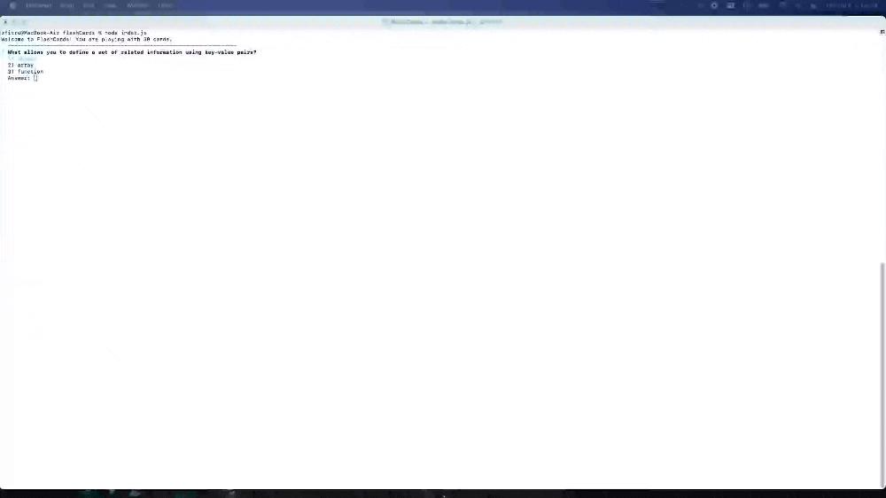

# FlashCard  

## Abstract:

- This was the first solo project I was assigned to complete starting the second Mod at Turing. This app allows the user to play a flashcard game in the terminal. The user is presented with multiple answers or a true or false answer based on the questions presented in the terminal. If the user scores less than 90%, the game will display a message of the score and will continue to play until the user scores higher than 90%.

## Preview of App:

## Technologies used

 

 

 

 

 

 

## Installation Instructions:

1. Select `fork`.
2. Decide where you want to clone this repo in `YOUR` terminal.
3. Select the `Code` button and copy the `SSH` provided.
4. `YOUR` terminal command should look like the line below.
5. `git clone git@github.com:ZTFitru/flashCards.git`
6. Move into the directory using `cd [dir_name]`.
7. If using `Visual Studio Code` use the `code .` command in your terminal to run it.
8. To play the flashcard game, type `node index.js` in your terminal.
9. If you just want to `Clone` skip steps 1 & 2.